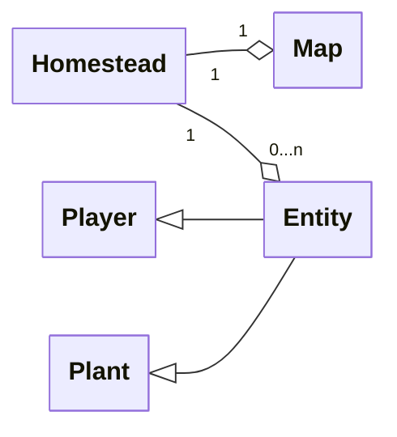

# Homestead
  - A game about the day to day life on a farm in the countryside
  
## Features
  - The map will be 2d, and involve multiple places that can be traveled to
  - There will be farming mechanics, as well an inventory for tools
  - Events and actions take place over the course of a day on the farm
  - It will be roguelike, so the game restarts on another day; crop/livestock states will be maintained
  - Prototype in Processing IDE
  
## UML Diagrams
  

  

